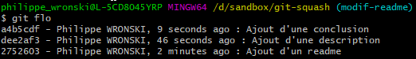

## Git

### Gitflow
Pour une meilleurs gestion des branches, il est recommandé d'utiliser gitflow. Gitflow est un addon de Git a installer manuellement. Il fournit un ensemble commande supplémentaire pour la gestion des branches.

Pour plus d'information sur le fonctionnement et l'utilisation de gitflow avec git, se reporter au lien suivant : https://danielkummer.github.io/git-flow-cheatsheet/index.fr_FR.html

### Alias
Les alias git sont des raccourci similaire au alias linux. Ci-dessous une liste d'alias possible.

```sh
git config --global alias.co checkout
git config --global alias.br branch
git config --global alias.ci commit
git config --global alias.st status
git config --global alias.pl pull

git config --global alias.com 'checkout master'
git config --global alias.rem 'rebase master'
git config --global alias.last 'log -1 HEAD'
git config --global alias.flo 'log --pretty=format:"%h - %an, %ar : %s"'
git config --global alias.flog 'log --pretty=format:"%h - %an, %ar : %s" --graph'
git config --global alias.sq 'rebase -i'
git config --global alias.new 'checkout -b'
git config --global alias.pnew 'push -u origin'
```

### Rebase Intéractif
Le rebase interactif `rebase -i` permet de modifier l'historique des commits sur une branche. Il permet par exemple de squasher certain commits. Cette action aura pour effet de fusionner le commit désigné comme `squash` ou `s` avec celui désigné comme `pîck` ou `p`.

L'utilisation du `squash` permet de simplifier la relecture de code dans une PR. En effet, ici, le but est de ne gardé qu'un commit dans l'historique. Il permet également lors de l'utilisation d'un système de CI/CD de n'éxécuter qu'un build car un seul commit.





### Git Hooks
Les hook sont en réalité des scripts (Bash, Node.js, Perl, Python, PHP…) qui s'éxécutent lors de l'utilisation de commande git. Ils permettent d'automatiser une partie du travail côté client et/ou cöté serveur. Il est possible avec des hooks de mettre en place un système de CI/CD personnalisé.

- Ils sont "par défaut" présents dans chaque répertoire projet dans le sous-répertoire .git/hooks.
- Leur nom est conventionnel et chaque fichier de script doit être exécutable (chmod +x .git/hooks/…).
- Leur emplacement fait qu’ils peuvent être supprimés ou désactivés par l’utilisateur sur un poste local.

**/!\ Les hooks locaux n’ont pas une vocation de contrôle, mais plutôt de soutien.**

Certain hook comme les `pre-[command]`sont bloquant et stop la commande en cours si le hook remonte des erreurs.
Il est possible de les contourner avec l'option `--no-verify`.

Pour plus de détails sur les hooks, voici un liens qui décrit avec un scope assez large, le fonctionnement des hooks. https://delicious-insights.com/fr/articles/git-hooks/

Tous les hooks on leur importance. Cependant, celui à ne pas manquer est:
- `pre-commit`: avant la création du commit, avant même l’édition du message (ex. : linting, tests unitaires courts).

#### pre-commit
Avec ce hooks, il est possible de vérifier tout un tas de chose comme par exemple s'il reste des erreurs/TODO dans notre code. Il est également possible de lancer des tests et/ou des linters pour analyser la qualité du code envoyé. Ce dernier cas s'inscrit dans le cadre de l'amélioration continue.

#### Avec node.js
Le trio `prettier`, `lint-staged` et `husky` fonctionne trés bien.

- `prettier` se charge de formater le code.
- `lint-staged` s'occupe de lancer des commande sur les fichier staged.
- `husky` exécute des commandes lors de l'appel des hooks.

Pour plus de détails sur l'utilisation simultané de ces 3 modules, se rendre ici : https://prettier.io/docs/en/precommit.html#option-1-lint-staged-https-githubcom-okonet-lint-staged

//TODO il y a également un exemple dans ...

## Gitkraken

### Gitflow
Gitkraken fournit une interface pour l'activation de Gitflow. La seule chose à faire est de renseigner le nom des branches de base et de valider.


### Squash
Gitkraken permet de squash des commits. Pour cela, il suffit de sélectionner plusieurs commits et de faire un clic gauche pour afficher le menu contextuel.


### Git Hooks
Les hooks sont liés au répertoire `.git` du projet. Gitkraken ne gère pas les hook à proprement parler, mais affiche leur résultat si ils existent.